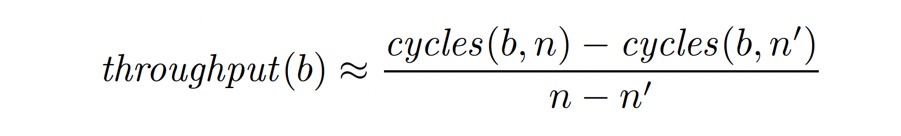

# The progress of collection of dataset for GranLte

### Context:
To Train GranLte, we need a large dataset of LLVM IR Basic Block/MIR Basic Block with throughput recorded. The dataset [Granite](https://arxiv.org/abs/2210.03894) is using is [Bhive](https://github.com/ithemal/bhive), a large dataset of X86 Basic Block extracted from applications including  Scientific Computing, Database, Compiler, Machine Learning, with throughput recorded. We want to extract LLVM IR Basic Block from those applications and leverage [Bhive's timing script](https://github.com/ithemal/bhive/tree/master/timing-harness) to measure the throughput of those Basic Blocks (See Appendix for details of Bhive's methodology of measuring throughput).

### Challenges:
A notable challenge is the absence of mapping data in Bhive that links the X86 Basic Block back to the source code or the LLVM Basic Block. This means we cannot utilize Bhive's pre-existing measurements. Instead, we need to replicate the entirety of Bhive's measurement process, ensuring that we maintain a record of the correspondence between LLVM Basic Block and X86 Basic Block with throughput.

### Failed Attempt:
Our preliminary approach attempts to uplift the already-measured X86 Basic Block to the LLVM IR Basic Block through existing decompilers. An accurate decompiler would have streamlined our data collection, obviating the need to redo all measurements. However, our attempts with renowned decompilers were largely unsuccessful:
1. [remill](https://github.com/lifting-bits/remill): A static binary translator that translates machine code instructions into LLVM bitcode.When tasked with translating an x86 basic block with a singular pushq %rax instruction, remill outputted an expansive llvm program to mimic this behavior, which is not our expected output. A detailed report can be found in [remill.out](/remill.out)
2. [reopt](https://github.com/GaloisInc/reopt): Designed for general-purpose decompilation and recompilation, reopt can only process complete assembly programs and not mere basic blocks.

### Revised Strategy
Uplifting X86 basic block to LLVM IR is a tough work and hard to be accurate and capture all optimization done in llc level. Therefore, we decided to re-do the measurement to ensure that we maintain an accurate mapping from LLVM Basic Block to X86 Basic Block throughout.

### Test Machine
The measurement tools and methodologies detailed in [bhive](https://ieeexplore.ieee.org/document/9042166),  necessitate a processor equipped with performance counters, capable of recording L1 cache read/write misses and context switch times. Several attempts to deploy bhive's measurement script met with failures: 
1. eecs583b.eecs.umich.edu: This platform was unsuitable due to the absence of requisite performance counters.
2. CAEN (login-course.engin.umich.edu): The system lacked the nasm tool, essential for assembly compilation in tandem with C. 

Finally, bhive's measurement script successfully worked on the server at the University of Waterloo. The processor of the server is an [Intel(R) Xeon(R) Gold 6148 CPU @ 2.40GHz](https://ark.intel.com/content/www/us/en/ark/products/120489/intel-xeon-gold-6148-processor-27-5m-cache-2-40-ghz.html). The result of measurement is similar to [bhive's example](https://github.com/ithemal/bhive/tree/master/timing-harness#readme)

### Next Plan
#### 1. Modify Bhive's Program:
**Objective**:\
To automate the throughput computation of numerous x86 basic blocks without having to restart the program for each block.

**Implementation**:\
Alter Bhive's main program structure to an infinite loop. \
In each iteration of the loop:
* Read an x86 basic block and compute its throughput
* Provide a mechanism to safely exit the loop, such as a specific input or a termination signal, to avoid being trapped in the infinite loop during testing.

#### 2. Design a Python Automation Script
**Objective**:\
To streamline the process of iterating over LLVM files, converting them to x86 basic blocks, subsequently computing their throughput using the modified Bhive's program and store LLVM basic block, x86 basic block and throughput to some location safely.

**Implementation**:
1. Navigate through the directory containing all *.ll files and init a new process running the modified Bhive program.
2. For each LLVM basic block in the *.ll file, Use the `llc` tool to lower the LLVM basic block to its corresponding x86 basic block.
3. Feed the generated x86 basic block to the modified Bhive's program
4. Wait for the result (throughput) from Bhive's program. 
4. Store the result in an organized manner, possibly mapping each LLVM basic block to its corresponding throughput measurement.

### Concerns
Our current plan is using static disassembler to generate x86 basic blocks; however, [bhive's experiments](https://ieeexplore.ieee.org/document/9042166) indicates that static disassemblers unable to distinguish padding bytes from instructions, so they extracted basic blocks from these applications using a
dynamic analysis implemented in [DynamoRIO](https://github.com/DynamoRIO/dynamorio). However, it will be very complex if we want to keeping track of these dynamically fetched x86 basic block back to llvm ir basic block. Therefore, we decide to use static disassembler first.

# Appendix

### How do you define the throughput of a basic block?
The throughput of a basic block is commonly defined as the average
number of clock cycles per iteration when executing the basic block
repeatedly in a "steady" state [(Abel A. & Reineke J.)](https://arxiv.org/pdf/2107.14210.pdf). Here, "steady" means the processor is running under some modeling assumptions (by Bhive):
1. All memory accesses are executed optimally. This means there are no cache or TLB misses, no unaligned loads.
2. There are no branch mispredictions.
3. There are no operations that lead to exceptions, and no interrupts(context switch) occur during the execution.
4. There are no Subnormal Floating Point.

### How do you calculate the throughput of a basic block?
Bhive will calculate a basic block in two pass: first it unrolls(duplicates) the basic block `b` for `n` times and calculate `cycles(b, n)`; then it unrolls `b` for `n'` times and calculate `cycles(b, n)`. Then they apply Abel and Reineke's idea to derive basic block throughput: 
  
For more details in calculating `cycles(b, n)`, please refer to [Bhive's original paper](https://ieeexplore.ieee.org/document/9042166).
