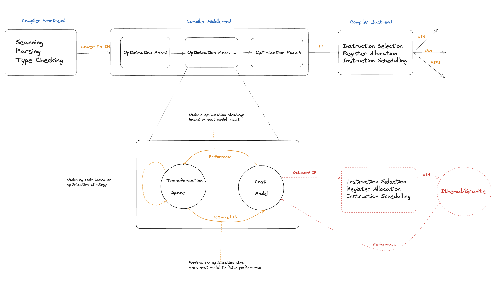
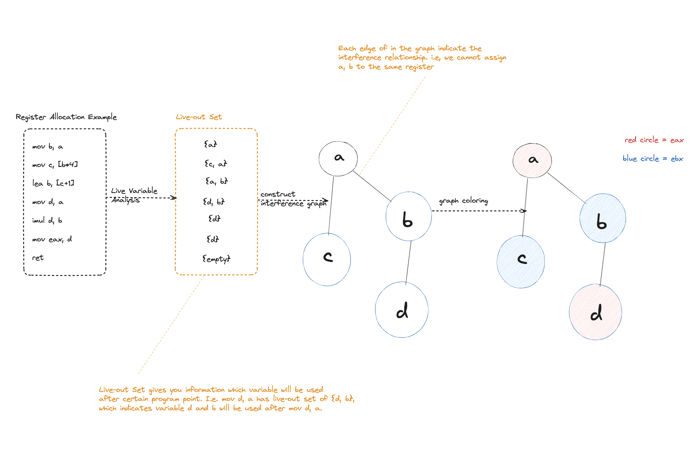

GRANLTE:
========

`GranLte` is a graph neural network model for LLVM IR basic block throughput(clock cycle in steady state) estimation. It is inspired by [Granite model](https://arxiv.org/abs/2210.03894) and the [Ithemal hierarchical LSTM model](https://arxiv.org/abs/1808.07412), but estimates basic block on LLVM IR level instead of x86 machine code level, providing more generality and efficiency for Compiler Autotuning and performance estimation. The key idea is to extend Granite model by incorporating the **[interference graphs](https://www.google.com/search?q=what+is+interference+graph+in+register+allocation&sca_esv=564243185&ei=yYb-ZPLpCuOgqtsPv8-l4AI&ved=0ahUKEwiy8qyhzKGBAxVjkGoFHb9nCSwQ4dUDCBA&uact=5&oq=what+is+interference+graph+in+register+allocation&gs_lp=Egxnd3Mtd2l6LXNlcnAaAhgDIjF3aGF0IGlzIGludGVyZmVyZW5jZSBncmFwaCBpbiByZWdpc3RlciBhbGxvY2F0aW9uMgsQIRgWGB4YHRiLA0iUHlD2AViiHHABeAGQAQCYAdgBoAHEF6oBBjQuMTguMbgBA8gBAPgBAcICChAAGEcY1gQYsAPCAggQABgWGB4YD8ICCBAAGIoFGIYDwgIFECEYqwLCAggQIRgWGB4YHcICBRAhGKABwgIIECEYoAEYiwPCAggQIRirAhiLA8ICDRAhGBYYHhgPGB0YiwPiAwQYACBBiAYBkAYG&sclient=gws-wiz-serp)** of basic blocks (an interference graph represents conflicts between variables, indicating which ones cannot be assigned to the same register simultaneously) to let the model capture the impact of register allocation and learn the gap between LLVM IR and Machine Code. We name it `GranLte`, where 'L' stands for LLVM IR.

Motivation:
-----------

Machine learning these days has been playing an important role in Compiler Optimization [(Ashouri et al., 2018)](https://arxiv.org/abs/1801.04405). Accurately and efficiently predicting the throughput of a basic block is an essential requirement in these machine learning based compiler optimization for guiding the algorithm to find the global optimal solution(See below figure for more details). Measuring basic block throughput by running the code on real hardware is too expensive for machine learning based compilers and most state-of-the-art analytical models(hand-written models), including `llvm-mca` [(Di Biagio & Davis, 2018)](https://llvm.org/docs/CommandGuide/llvm-mca.html) and `ICIA` [(Intel, 2017)](https://www.intel.com/content/www/us/en/developer/articles/tool/architecture-code-analyzer.html), fail to capture the exact mechanisms of the processors as underlying microarchitectures are upgraded frequently.

To alleviate this issue, Deep Neural Networks based performance model, `Ithemal`[(Mendis, 2019)](https://arxiv.org/abs/1808.07412), was born. It utilizes sequential Long-Short Term Memory (LSTM) to learn a representation of basic blocks followed by a linear transformation to predict the throughput values, which has less than half the error of `llvm-mca` and `ICIA`. However, `Ithemal` does not capture data dependency in basic blocks and has to train entire model separately on different microarchitectures. `Granite`[(Sýkora et al., 2022)](https://ieeexplore.ieee.org/document/9975403) addresses these issues by using graph neural network that takes advantage of the relational information captured in the graph and multi-task learning [(Caruana, 1997)](https://link.springer.com/article/10.1023/A:1007379606734) to reduce training cost. `Granite` reduced the error by 1.7% while improving training and inference throughput by approximately 3.0x [(Sýkora et al., 2022)](https://ieeexplore.ieee.org/document/9975403) compared to `Ithemal`.

However, to make high-level compiler optimization decisions, we need a cost model that can  accurately predict the cost of a high-level transformation in IR format. The below figure indicates the issue of applying `Ithemal` or `Granite` in tuning compiler optimizations.

  
The red dashed lines indicate the issue of a machine code level cost model. When querying the performance of the optimized IR, it is required to transform to X86 code first and feed to `Ithemal`/`Granite`, which creates a **long latency** in each query because we need to run compiler backend passes on the IR, making machine-learning based optimization hard to train. In addition, these kinds of models **do not work for other ISA** since they are x86 specific. In order to solve these issues, we propose to develop an LLVM IR cost model by extending the idea of `Granite` to capture the gap between IR and hardware ISA during training. 

Challenges:
-----------

Building cost models for compiler IR has the following additional challenges:

1.  Semantic gap between IR and hardware ISA
2.  Depends on the IR to hardware ISA instruction lowering process (register allocation, instruction scheduling)
3. In our method, interference graph may not accurately capture the register pressure information because interference graph constructed in IR level cannot capture implicit register usage in machine code level. For instance, [mul instruction](https://www.aldeid.com/wiki/X86-assembly/Instructions/mul) in x86 will implicitly read `eax` and implicitly write to `eax` and `edx`, which cannot be captured in IR level.

## Plan:
We plan to utilize both training and test IRs that mirror the semantics of x86 ISA, such as `add`, `sub`, and `mov` operations and adopt the default instruction scheduling strategy as implemented in `Clang` O0 at first. Our primary focus will initially be on addressing the challenges posed by register allocation. To do so, we'll integrate  [interference graphs](https://www.google.com/search?q=what+is+interference+graph+in+register+allocation&sca_esv=564243185&ei=yYb-ZPLpCuOgqtsPv8-l4AI&ved=0ahUKEwiy8qyhzKGBAxVjkGoFHb9nCSwQ4dUDCBA&uact=5&oq=what+is+interference+graph+in+register+allocation&gs_lp=Egxnd3Mtd2l6LXNlcnAaAhgDIjF3aGF0IGlzIGludGVyZmVyZW5jZSBncmFwaCBpbiByZWdpc3RlciBhbGxvY2F0aW9uMgsQIRgWGB4YHRiLA0iUHlD2AViiHHABeAGQAQCYAdgBoAHEF6oBBjQuMTguMbgBA8gBAPgBAcICChAAGEcY1gQYsAPCAggQABgWGB4YD8ICCBAAGIoFGIYDwgIFECEYqwLCAggQIRgWGB4YHcICBRAhGKABwgIIECEYoAEYiwPCAggQIRirAhiLA8ICDRAhGBYYHhgPGB0YiwPiAwQYACBBiAYBkAYG&sclient=gws-wiz-serp) of basic blocks into the graph neural network structure in [GRANITE model](https://arxiv.org/abs/2210.03894).  As our team grows and we onboard more teammates with diverse expertise, we anticipate the potential for richer discussions and brainstorming sessions, leading to even more innovative and effective solutions.

# Looking for teammates!
If you are interested in my project and either have experience in compiler optimization or machine learning, please send an email to me(lukezhuz@umich.edu) with your resume attached.

## Appendix
Why using Interference graph to handle the gap between IR and machine code?
  
Because it captures which variables cannot be assigned to the same register simultaneously (edge) and register pressure (node degree).